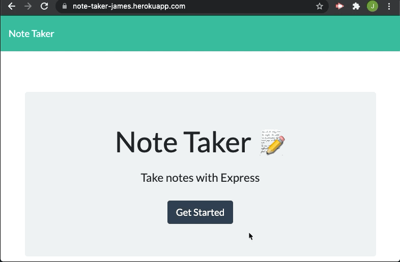

# Note Taker

## Keep a short list of persistent notes in your broswer!

[Open](https://jamesboblak.github.io/note-taker/) Note Taker:
https://jamesboblak.github.io/note-taker/

## Table of Contents

* [Installation](#installation)
* [Usage](#usage)
* [Credits](#credits)
* [License](#license)

## Installation

Click [here](https://jamesboblak.github.io/note-taker/) to run the app on Heroku.

To run the code locally:
Download the code from my repo [here](https://github.com/jamesboblak/note-taker).
In Terminal:
<code>npm install</code>
then
<code>node server.js</code>
This will prepare youoad the console-reported site into any browser.  

## Usage 

This is a good place to keep a to-do list that is frequently updated.  
To use this app:
Click on the Notes button.
Add a new Title and Text to your new note.Click the Save diskette icon.

## Credits

sole author  

## License

[The Unlicense](https://choosealicense.com/licenses/unlicense/)

## Badge

## Tests

No tests written yet

---

 This good readme was created by [readme-generator](https://github.com/jamesboblak/readme-generator) :)